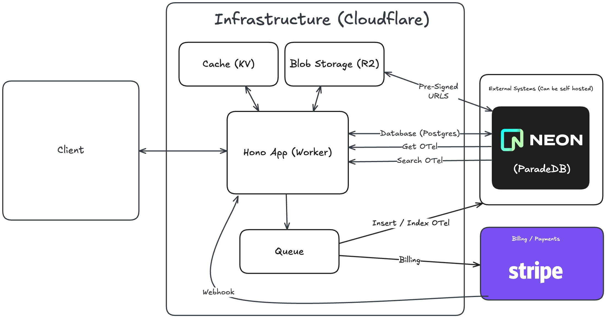

# Architecture Overview

## System Architecture

Lilypad is designed as a serverless, cloud-native platform that can be deployed on multiple cloud providers. The architecture emphasizes scalability, performance, and cost-effectiveness through a distributed computing model. The default implementation uses Cloudflare's infrastructure, with AWS as the primary alternative.

## Infrastructure Components

### Frontend (Client)

- **React 19** single-page application with TanStack Router
- **Tailwind CSS v4** for styling
- **TanStack Query** for efficient data fetching and caching
- Deployed via CDN for global low-latency access

### Cloud Provider Infrastructure

| Component         | Purpose                           | Cloudflare          | AWS                  |
| ----------------- | --------------------------------- | ------------------- | -------------------- |
| **Compute**       | API server, business logic        | Workers             | Lambda / ECS Fargate |
| **Cache**         | Session data, lightweight caching | KV Store            | ElastiCache (Redis)  |
| **Blob Storage**  | Files, artifacts, user content    | R2                  | S3                   |
| **Edge Cache**    | CDN caching                       | Cloudflare Cache    | CloudFront           |
| **Queue**         | Background job processing         | Queues              | SQS + Lambda         |
| **CDN**           | Static asset delivery             | Cloudflare CDN      | CloudFront           |
| **Load Balancer** | Traffic distribution              | Built-in            | ALB / NLB            |
| **DNS**           | Domain management                 | Cloudflare DNS      | Route 53             |
| **Security**      | DDoS, WAF                         | Cloudflare Security | AWS WAF + Shield     |

### Self-Hosted Services

These services are deployed consistently across all cloud providers:

#### Database & Storage

- **ParadeDB with `pg_search`**: Enhanced PostgreSQL with full-text search capabilities
  - Combines structured data storage with powerful search functionality
  - Local development environment with containerized PostgreSQL
  - Production deployment on Neon serverless PostgreSQL

#### Observability & Analytics

- **OTel (OpenTelemetry)**: Distributed tracing and monitoring for system observability
  - Built-in telemetry collection and analysis
  - Integrated with PostgreSQL for metrics storage via `pg_search` extensions

#### Payments & Billing

- **Stripe**: Payment processing, subscription management, and billing automation
  - External SaaS service with webhook integration

## Data Flow

### Request Processing

1. **Client** sends requests to the compute layer (Workers/Lambda)
2. **Compute Layer** processes requests, utilizing:
   - **Cache** (KV Store/Redis) for session management and caching
   - **Blob Storage** (R2/S3) for file operations
   - **ParadeDB** for database operations and full-text search
3. **Queue** (Cloudflare Queues/SQS) handles asynchronous processing for heavy operations
4. **Edge Cache** (Cloudflare/CloudFront) optimizes response times for frequently accessed data

### Telemetry & Monitoring

- **OTel** data flows to **ParadeDB** for analytics and monitoring storage
- **Search** operations utilize `pg_search` extensions for efficient content discovery
- **Billing** events trigger **Stripe** webhooks for payment processing

### Provider-Specific Implementation Notes

#### Cloudflare Implementation

- **Hono** framework runs natively on Cloudflare Workers
- Tight integration with Cloudflare's edge network
- Built-in DDoS protection and global distribution
- Simplified deployment and scaling

#### AWS Implementation

- **Hono** can run on AWS Lambda or ECS Fargate
- **Lambda**: Serverless, pay-per-request model
- **ECS Fargate**: Containerized deployment for more control
- Requires additional setup for load balancing and scaling
- More granular cost control and monitoring options

## Key Architectural Principles

### Serverless-First

- All compute resources scale automatically based on demand
- No server management overhead
- Cost-effective pay-per-use model

### Edge-Optimized

- Global distribution through CDN/edge network
- Reduced latency through geographical proximity
- Improved performance and user experience
- Provider-specific optimizations (Cloudflare Edge vs AWS CloudFront)

### Event-Driven

- Asynchronous processing through queue system
- Webhook-based integrations for real-time updates
- Decoupled architecture for better scalability

### Observability-Native

- Built-in telemetry and monitoring
- Comprehensive logging and tracing
- Real-time performance insights

## Security & Compliance

### Data Protection

- Encrypted data in transit and at rest
- Pre-signed URLs for secure file access (R2/S3)
- Role-based access control through PostgreSQL with Drizzle ORM

### Infrastructure Security

- Cloud provider security features:
  - **Cloudflare**: DDoS protection, WAF, Bot Management
  - **AWS**: WAF, Shield, GuardDuty
- OAuth integration for authentication
- Secure environment variable management
- Network isolation and VPC configuration (AWS)

## Scalability Considerations

### Horizontal Scaling

- Compute instances scale automatically based on load:
  - **Cloudflare**: Workers auto-scale globally
  - **AWS**: Lambda auto-scaling or ECS with auto-scaling groups
- Database connections managed through connection pooling
- Queue system handles variable workloads

### Performance Optimization

- Multi-tier caching strategy:
  - **Cloudflare**: KV Store + Edge Cache
  - **AWS**: ElastiCache (Redis) + CloudFront
- Efficient data structures and query optimization
- CDN integration for static assets

## Deployment Strategy

### Environment Management

- Production deployment on `lilypad.mirascope.com`
- Development environment with localhost CORS
- Environment-specific configuration management
- Provider-specific environment setup:
  - **Cloudflare**: wrangler.toml configuration
  - **AWS**: CDK/CloudFormation templates

### CI/CD Pipeline

- Automated testing with Vitest
- Code quality checks with ESLint and Prettier
- Provider-specific deployment automation:
  - **Cloudflare**: Wrangler CLI deployment
  - **AWS**: CDK/SAM deployment pipelines

## Future Cloud Provider Support

The architecture is designed to easily accommodate additional cloud providers:

### Planned Providers

- **Azure**: Functions, Cosmos DB, Blob Storage, CDN
- **Google Cloud**: Cloud Functions, Firestore, Cloud Storage, Cloud CDN

### Extension Pattern

New providers can be added by:

1. Adding provider column to infrastructure mapping table
2. Creating provider-specific deployment configurations
3. Implementing provider-specific optimizations
4. Updating CI/CD pipelines for new deployment targets

This architecture provides a robust, scalable foundation for Lilypad while maintaining developer productivity and operational efficiency.
